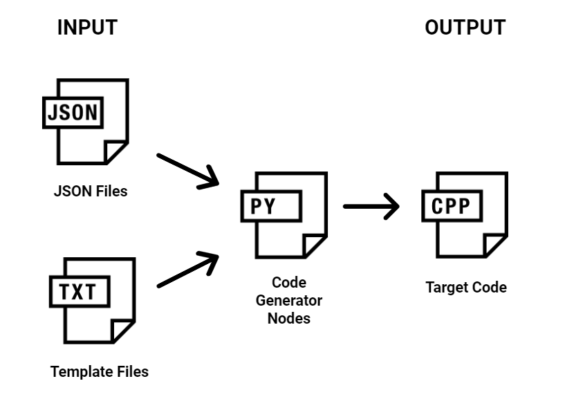
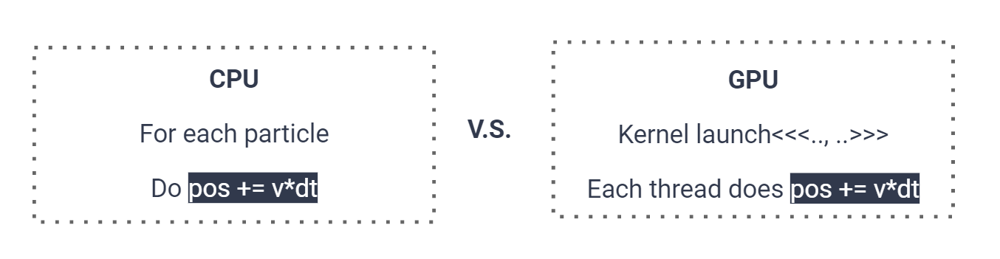
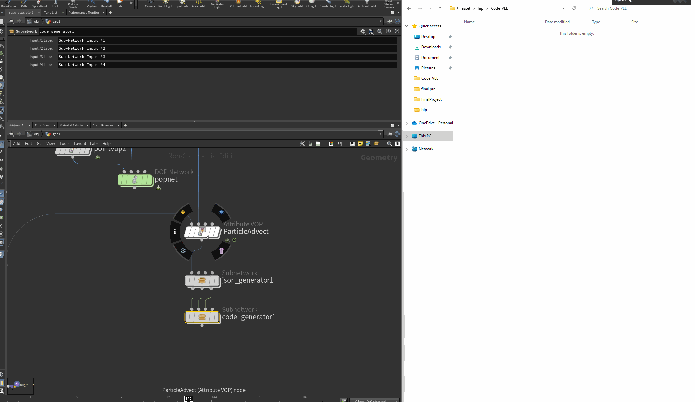

# CUDA-Kernel-Node-Editor-For-Houdini

**University of Pennsylvania, CIS 565: GPU Programming and Architecture, Final Project**

<p align="center">
  
</p>

## **Team members:**
  - Dongying Liu: [LinkedIn](https://www.linkedin.com/in/dongying-liu/), dongying@seas.upenn.edu
  - Wenqing Wang: [LinkedIn](https://www.linkedin.com/in/wenqingwang0910/), wqwang@seas.upenn.edu
  - Yuchia Shen: [LinkedIn](https://www.linkedin.com/in/yuchiashen/), chia0510@seas.upenn.edu


# Project Overview

## **Goals**
Provide an cuda kernel node editor for Houdini. 
Users can create various types of effects based on Houdini VOP node, and our tool can auto-generate both CPU (for debugging) and CUDA code based on the VOP node.

## **Target Users** 
Technical Artist
Even if the technical artist or other users who is not familiar with those holy graphics APIs can do CUDA development with our tool.
The only thing our user need to worry about is how to create effect with Houdini VOP node. It doesn't matter to them how the algorithem will actually generate backend.

## **Why Houdini**
Among all the cool game engines which also has node base editor like Unreal and Unity, why we choose Houdini?

```Visual Debugging System``` 
For our target users, Houdini has a powerful visual debug system, which means we can immediatly see the result from the scene view window whenever we make changes. And this perticularly benifit our users, who will create and visualize the effects with Houdini VOP Node.
Except the realtime result. Houdini has this spreadsheet where we can check attributes for every points primitive of the geometry like position, color, normal and even more custom attributes to see if the value reaches our expectations.

```Powerful Python API``` 
For us the code generator development, Houdini has a powerful python API. We can write python with python nodes in Houdini and see real time result with our code wrote. And what's more, with the print node of the VOP node, we can easily generate ground truth for our code generator to debug for our code generator.

## **Is This Project Highly Dependence on Houdini?**
The answer is... No!
We designed our code generator decoupling with JSON, which means every steps of our code generator will communicate with their next step with JSON.
Houdini is only a front end application. as long as the application can generate the same formatted JSON(which the format is designed by us), we can use the follow up python program to generate code immediatly. For more information, please checkout the next part: Code Generator Pipeline.

## **What's next? Future Potential?**
Now we are only generating CUDA code base on the information we get from the JSON files. With all the information needed stores in the JSON files, we can generate code for multiple platform later.

# Code Generator Pipeline
## User Created Houdini VOP Node
User will create various effect with Houdini VOP Nodes.
The VOP nodes which user created is the core of our code generator, which we will auto-generate what we called CPU-GPU Generic Code from.

## VOP to JSON Files
```Input:``` User created Houdini VOP nodes.
```Output:``` JSON files for auto code generation.
The outputs of this stage are a series of JSON files.
In this step, we will translate the Houdini VOP Node to directed acyclic graph(DAG) and save all the calculation information needed to several JSON files.

The first step in this phase is to work with the developer in the next phase to determine the format of the JSON file and the required information based on the reference code (here we refer to Houdini's VEX code). For example, in order to parse the `add` node in our VOP network into the following line of code, the information that must be included in the JSON is: node name, operation, input list, output list, as well as the connections to inputs and outpus.
```
float sum = input1 + input2;
```
## JSON to Code

The JSON to Code phase has two main inputs. One is the JSON file from the previous phase, which contains information about each node in the VOP network and their connections. The other is a template file that defines the main components of the target code snippet. The final output of this stage is all the files we need to generate the solution, including the CPU/GPU header/source files and our generic code files.



### CPU-GPU Generic Code Generation
#### Concept Introduction
CPU-GPU Generic Code is a code segment that can be run on both CPU and GPU. In the generated target files, the generic code contains all the functions used to implement the core algorithm and will be called by both CPU and GPU code in the later stage.
#### Simple example
Smoke particle effect would be a good example here to help understand what is generic code. The core algorithm of this effect has only one line of code:
```
pos += v*dt
```
Now, suppose we need to implement this effect on both the CPU and GPU.


On the CPU, we will use a for loop to iterate over each particle and update their position using this formula. While on the GPU side, we'll call kernel launch and let each kernel compute the new position in parallel.

Although the way of traversing the particles is different, the code used to calculate its new position is the same. This line of code is an example of CPU-GPU Generic code.
<p align="center">
  
</p>

## Read in Houdini data (CGBuffer)
To properly handle the data from Houdini, we created a helper class ```CGBuffer```. With this helper class, we can maintain the memory usage in both Host and Device using fixed functions. This greatly reduces the difficulty of generating real codes as we can use fixed functions to replace original codes.

Therefore, initially, the data would be stored in the class ```CGBuffer```. Then, it will be uploaded to host or device container depending on what process unit we want to use. Afther that, we process the operations on the data and copy to the host side to do final output.

## Code to OBJ
After running the calculation, the program will generate an OBJ file to visualize the result on Houdini. The difficult of this part is to build a tenplate code for all of the possible data type. Here, we use a ```void pointer``` to handle the data, so that we can point to different data type without any compilation error. Then, we can output the format we want according to the data type. The OBJ file contains all the position of the points in one specific frame. 

## Test OBJ Back in Houdini
<p align="center">
  
</p>

# Results
## Example 1: Simple particle
### Visualization of auto-generated code
<p align="center">
  
</p>

### Particle Emitter
This custom class aim to generate particles during the program. Since our original code can not change the size of the memory allocation during calculation, we need an additional helper class to fix the problems. This helper class will bind every data buffer in the program and increase the sizes of the buffers in the middle of the calculation. Therefore, the particles in the rendering will increase to perform a better effect.

## Example 2: Tornado (velocity field)
### Visualization of auto-generated code
<p align="center">
  
</p>

